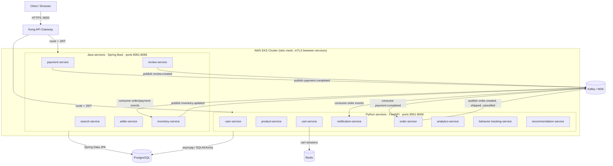

# Scalable E-Commerce Platform

A microservices-based e-commerce platform with 14 services implemented in Python (FastAPI) and Java (Spring Boot).

## Architecture

### Python Services (FastAPI + SQLAlchemy)
- user-service - Authentication and user profiles
- product-service - Products and categories
- cart-service - Shopping cart
- order-service - Order management
- notification-service - User notifications
- analytics-service - Sales analytics
- behavior-tracking-service - User behavior tracking
- recommendation-service - Product recommendations

### Java Services (Spring Boot)
- payment-service - Payment processing
- inventory-service - Inventory management
- search-service - Product search
- review-service - Product reviews
- seller-service - Seller management

### Infrastructure
- Kong API Gateway
- PostgreSQL
- Redis
- Kafka (MSK) - asynchronous order, payment, inventory, and review events; see [the event catalog](docs/event-catalog.md)

## System Architecture Diagram



Plain-text version (same picture, no renderer required):

```text
                              +------------------+
                              |  Client / Browser|
                              +------------------+
                                        |
                                        | HTTPS :8000
                                        v
                              +------------------+
                              | Kong API Gateway |   <-- load balancer / router
                              +------------------+
                                 |            |
                    route+JWT   |            |   route+JWT
                                 v            v
        +----------------------------+  +----------------------------+
        |  Python services (FastAPI) |  |  Java services (Spring Boot)|
        |  ports 8001-8008           |  |  ports 8081-8085            |
        |----------------------------|  |----------------------------|
        |  user-service              |  |  payment-service            |
        |  product-service           |  |  inventory-service          |
        |  cart-service              |  |  search-service              |
        |  order-service             |  |  review-service              |
        |  notification-service      |  |  seller-service               |
        |  analytics-service         |  +----------------------------+
        |  behavior-tracking-service |            |
        |  recommendation-service    |            |
        +----------------------------+            |
             |              |                      |
   asyncpg   |     cart     | order/payment/inventory| JPA
             |   sessions   |  /review events       |
             v              v                       v
       +-----------+  +-----------+          +--------------+
       | PostgreSQL|  |   Redis   |          |  PostgreSQL  |
       +-----------+  +-----------+          +--------------+
                              |
                              v
                       +--------------+
                       |  Kafka (MSK) |
                       +--------------+
                          |        |        |
             consume order/payment | consume order
                          v        v        v
              +-------------------+  +-------------------------+
              | inventory-service |  |  notification-service    |
              +-------------------+  +-------------------------+
```

## File Structure

```text
scalable-ecommerce-platform/
├── services/                    # 14 services (pattern below)
├── shared/
│   ├── python-common-lib/       # auth, config, db session, Kafka helpers
│   └── java-common-lib/         # SecurityConfig, JWT filter, common DTOs
├── api-gateway/
│   └── kong/                    # route + plugin config
├── infrastructure/
│   ├── terraform/                # eks, rds, elasticache, msk modules
│   ├── kubernetes/               # base manifests + dev/prod overlays
│   ├── istio/                    # gateway, mTLS, destination rules
│   └── docker-compose/
├── ci-cd/
│   └── argocd/
├── docs/
│   ├── adr/                      # architecture decision records
│   └── api-specs/                # OpenAPI yaml, one per service
├── .github/workflows/            # ci.yml, cd.yml
├── docker-compose.yml
├── kong.yml
└── README.md
```

**Python service pattern** (`services/order-service/`, same shape for all 8):
```text
order-service/
├── app/
│   ├── main.py          # FastAPI app, routes, auth deps
│   ├── config.py
│   ├── models.py        # SQLAlchemy models
│   ├── schemas.py       # Pydantic request/response
│   └── crud.py          # DB access
├── migrations/versions/ # Alembic revisions
├── alembic.ini
├── tests/
├── Dockerfile
├── pyproject.toml
└── .env.example
```

**Java service pattern** (`services/payment-service/`, same shape for all 5):
```text
payment-service/
├── src/main/java/.../
│   ├── controller/
│   ├── service/
│   ├── repository/
│   ├── entity/
│   ├── dto/              # Lombok @Data/@Builder
│   └── *Application.java # @Import(SecurityConfig.class)
├── src/main/resources/application.yml
├── src/test/java/.../
├── Dockerfile
├── pom.xml
└── .env.example
```

## Prerequisites

- Docker and Docker Compose
- Python 3.11+
- Java 17 (for local development of Java services)
- Maven (for local development of Java services)
- Poetry (for local development of Python services)

## Quick Start

```bash
# Start all services
docker-compose up --build

# Stop all services
docker-compose down
```

## Service Ports

| Service | Port |
|---------|------|
| Kong Gateway | 8000 |
| PostgreSQL | 5432 |
| Redis | 6379 |
| user-service | 8001 |
| product-service | 8002 |
| cart-service | 8003 |
| order-service | 8004 |
| notification-service | 8005 |
| analytics-service | 8006 |
| behavior-tracking-service | 8007 |
| recommendation-service | 8008 |
| payment-service | 8081 |
| inventory-service | 8082 |
| search-service | 8083 |
| review-service | 8084 |
| seller-service | 8085 |

## Development

### Python Services
```bash
cd services/[service-name]
poetry install
uvicorn app.main:app --reload
```

### Java Services
```bash
cd services/[service-name]
mvn spring-boot:run
```
